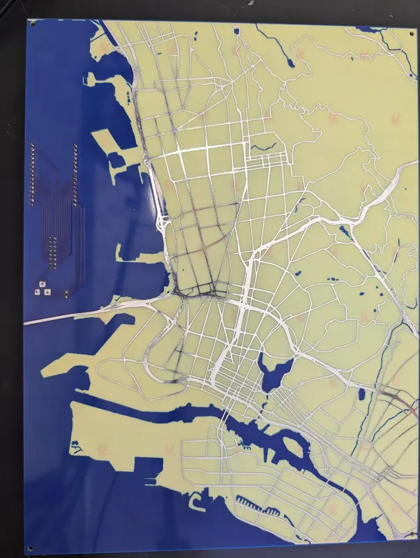
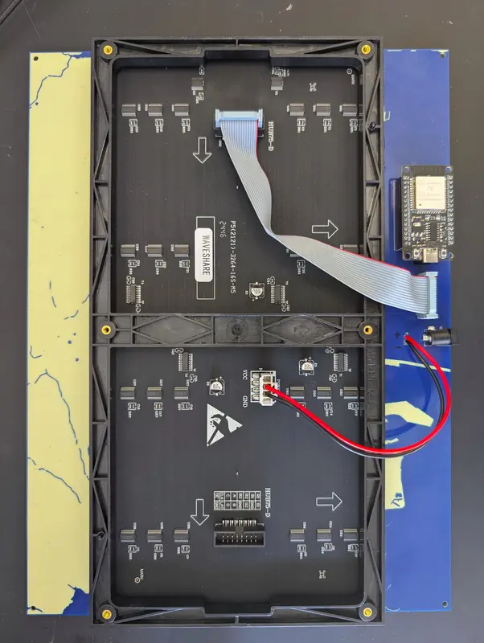

# PCB Map Display

This project is two related parts. First is the PCB map itself. This is a PCB art piece that combines a map of the East Bay of California with an LED matrix display. The second part is the software to control the display.





The software is designed to be a fairly flexible controller for a matrix display, and the whole project could easily be used with a map printed on paper instead of a custom PCB.

<video src="docs/demo.mp4" autoplay loop muted playsinline></video>

See <https://www.robopenguins.com/pcb-map/> for the design process.

---

## PCB Design Files

The design files can be found in `design/`.

The full design is in `design/map_board.kicad_pcb`, while the schematic for the ESP32 connected the the LED panel was designed in `design/wiring_project/map_lights.kicad_pro`

---

## Firmware

The firmware is located in the `firmware/` directory and is built using PlatformIO.

### Building and Uploading
To upload the firmware to your ESP32, use the provided helper script:
```bash
./scripts/upload_firmware.sh
```
This script uses PlatformIO to build the project and upload it to `pcb-map.local` (once the device is on your network).

### Initial WiFi Setup
If the device has no saved WiFi credentials, it will start an Access Point named **pcb-map-ap**. Connect to this AP with your phone or computer to configure your local WiFi settings via the captive portal.

### OTA Updates
The firmware supports Over-The-Air updates. Once configured on your network, you can re-flash the device wirelessly using PlatformIO's OTA functionality.

---

## Simulator

The simulator allows you to run the pcb-map logic on your desktop. It renders the LED matrix using SFML and connects to an MQTT broker to receive commands exactly like the hardware would.

### Building the Simulator
The simulator requires SFML, Paho MQTT C++, and OpenSSL. It uses CMake for building:

```bash
cd firmware/simulation
mkdir build && cd build
cmake ..
make
./matrix_sim
```
By default, it attempts to connect to a local MQTT broker at `tcp://localhost:1883`.

---

## Python Tools

The project includes a suite of Python scripts located in the `python/` directory to manage the device and feed it data.

### Environment Setup
Use uv to manage the Python environment:
```bash
uv --directory=python sync
source python/.venv/bin/activate
```

### Configuration
Set up your environment variables (usually via a script like `pcb_map_args.sh`):
```bash
export MQTT_HOSTNAME="your-broker-address"
export MQTT_USE_TLS=1
export MQTT_USERNAME="user"
export MQTT_PASSWORD="pass"
# Used to query the Google Maps API for route information
export GOOGLE_MAPS_API_KEY="your-api-key"
# Used to set specific colors for people when using shared location display
export USER_COLORS_FILE="$HOME/user_colors.json"
```

#### user_colors.json
Define specific colors for people when using shared location display:
```json
{
    "me": [0, 255, 0],
    "Joe Smith": [0, 0, 255],
    "Mary Sue": [255, 0, 0]
}
```

### Key Commands

#### Device Setup (`device-setup`)
- `find-devices`: Discovers the board via mDNS, MQTT, or by scanning for the setup AP.
- `setup-mqtt`: Configures the MQTT broker credentials on the device via a local UDP broadcast.
- `clear-wifi-creds`: Resets the WiFi settings on the hardware.

#### Control Server (`control-server`)
- `display-shared-locations`: Fetches shared Google locations and plots them on the matrix.
- `set-background-image [path]`: Uploads and displays a 64x32 RGB image as the map background.
- `simulate-route --start "Home" --dest "Work"`: Calculates a route and animates it on the display.
- `set-brightness [0-100]`: Adjusts the LED intensity.
- `clear-display`: Clears all active sprites and hides the background.
- `lat-long-to-xy`: A utility to check where a coordinate falls on the matrix grid.

---

## Development Utilities

**Formatting Code** (C++):
```bash
clang-format -style=Google -i firmware/src/*
```

## TODO
 - Improve fetching Google map creds for location sharing from a remote browser
 - Make location share able to run as a server more robustly
 - Scrape Google calendar for events with locations for drawing routes
